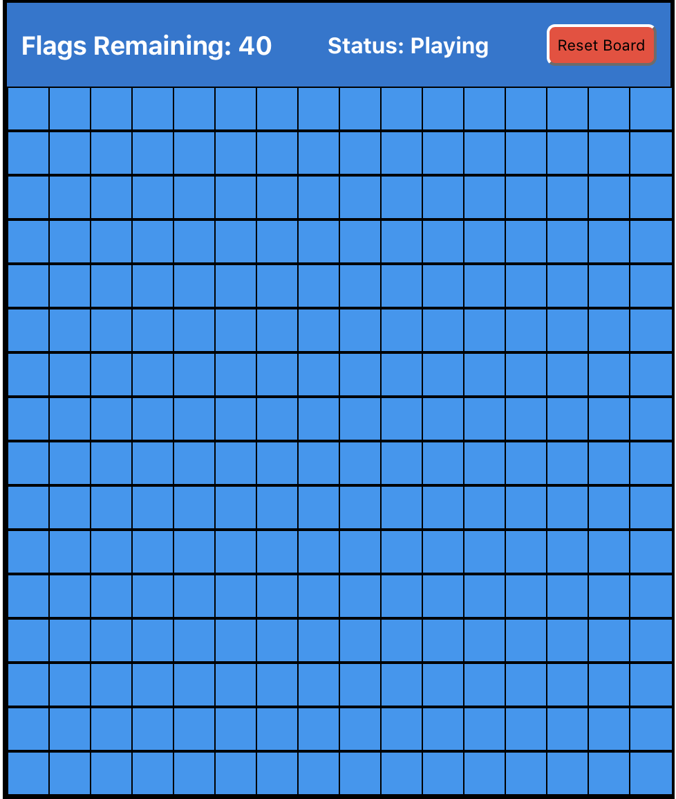
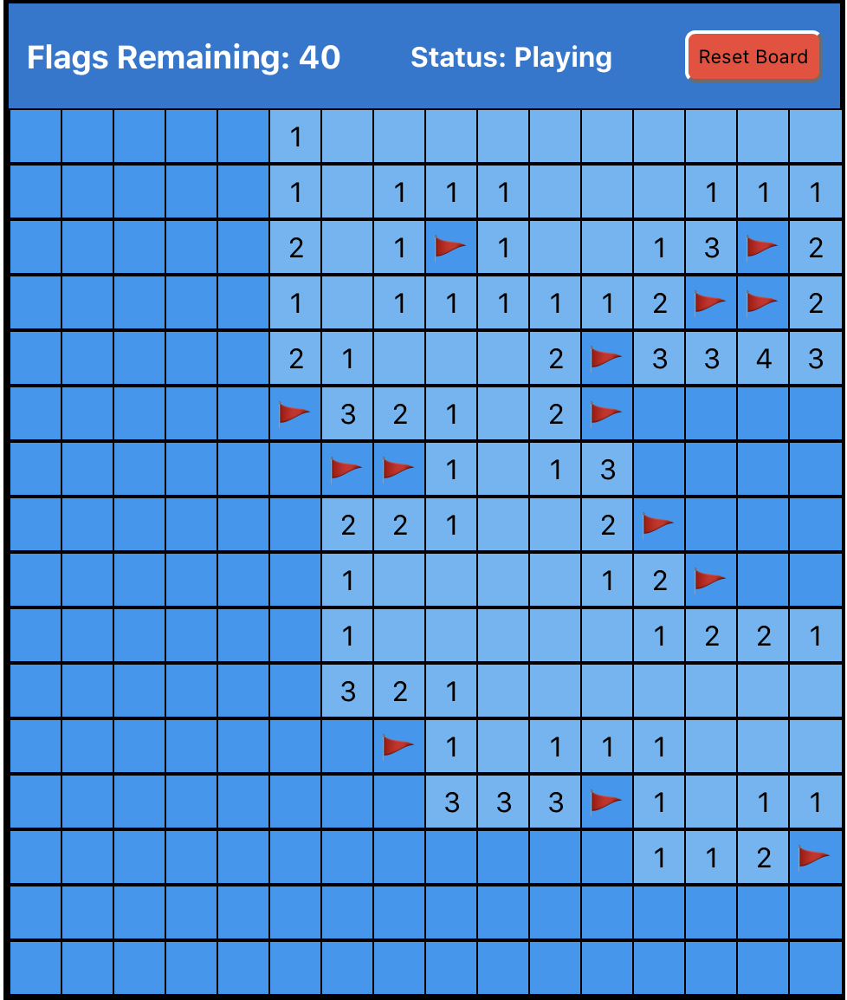
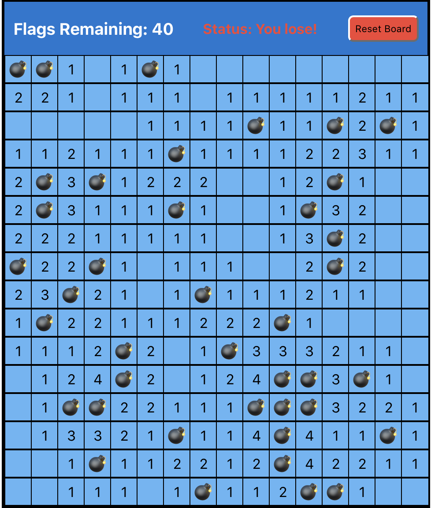
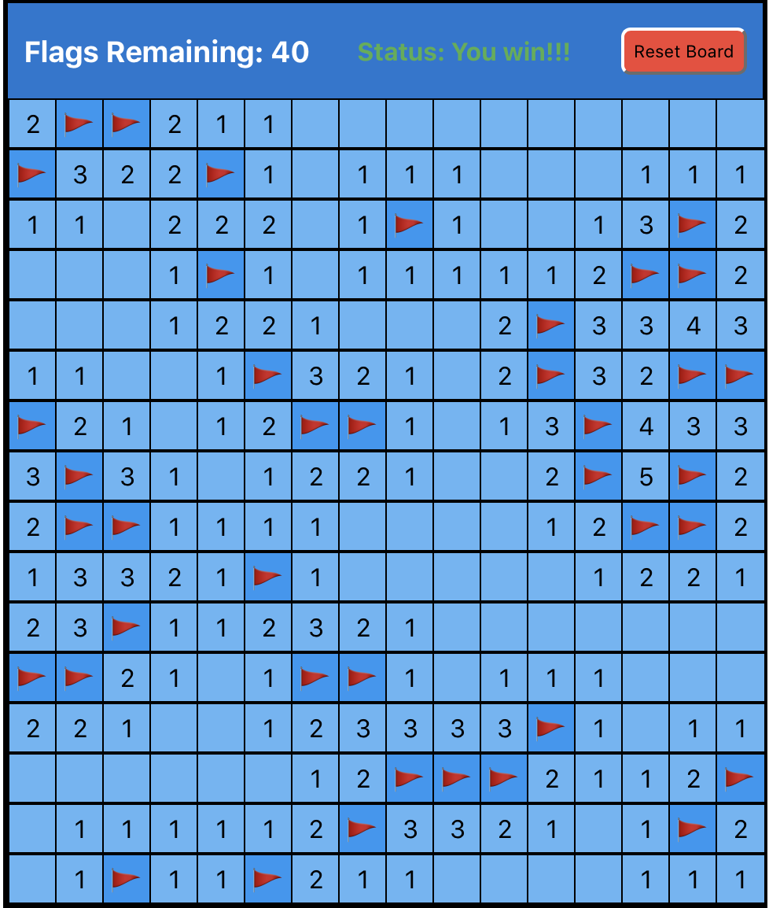

This project was bootstrapped with [Create React App](https://github.com/facebook/create-react-app).

# Minesweeper
The purpose in Minesweeper is to find and mark all of the mines hidden. This is done by clicking on squares to reveal them. Each square will have one of the following:
- A mine, and if you click on it you'll lose the game
- A number, which tells you how many of its adjacent squares have mines in them
- Nothing. In this case you will know that none of the adjacent squares have mines.

## Final Product

Game Start:

Mid-game:

Lose game:

Win game:

## Available Scripts

### `npm install`
In the project directory, you can run `npm install`

This will install all of the dependencies required to run the app.

### `npm start`

Runs the app in the development mode. 
Open [http://localhost:3000](http://localhost:3000) to view it in the browser.

The page will reload if you make edits. 
You will also see any lint errors in the console.
